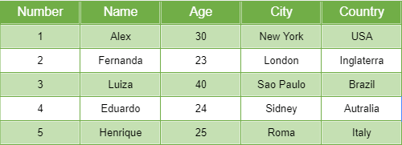
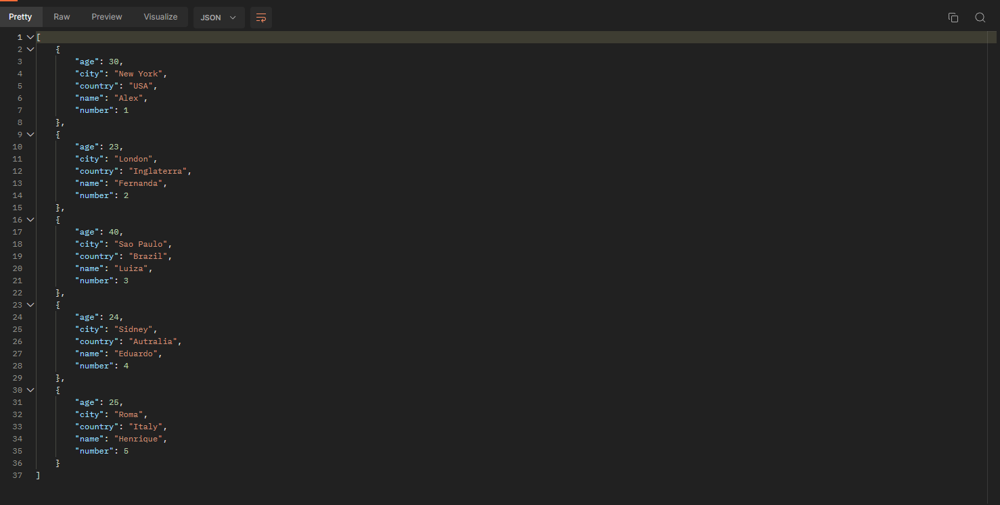

# Criando uma API com Flask 

Este código é uma aplicação web usando Flask, um framework web em Python. Ao acessar a rota principal ('/'), a API retorna uma mensagem de boas-vindas. A rota '/excel_to_json' é configurada para aceitar solicitações HTTP GET e POST. Quando acessada, ela lê um arquivo Excel chamado 'pessoas.xlsx' no diretório 'flask_desafio' e converte os dados contidos nesse arquivo para um formato JSON. Em seguida, a API retorna o JSON gerado como resposta. A aplicação Flask é executada localmente e pode ser acessada em [http://localhost:5000]() quando em modo de depuração (debug).

## Planilha que sera lida e tranformada em json

### Saida em json

Eu consegui fazer a api mas eu não consegui fazer no colaba ou jupyter do vs code

### Tecnologias utilizadas

- python = 3.12
- poetry
- flask
- pandas
